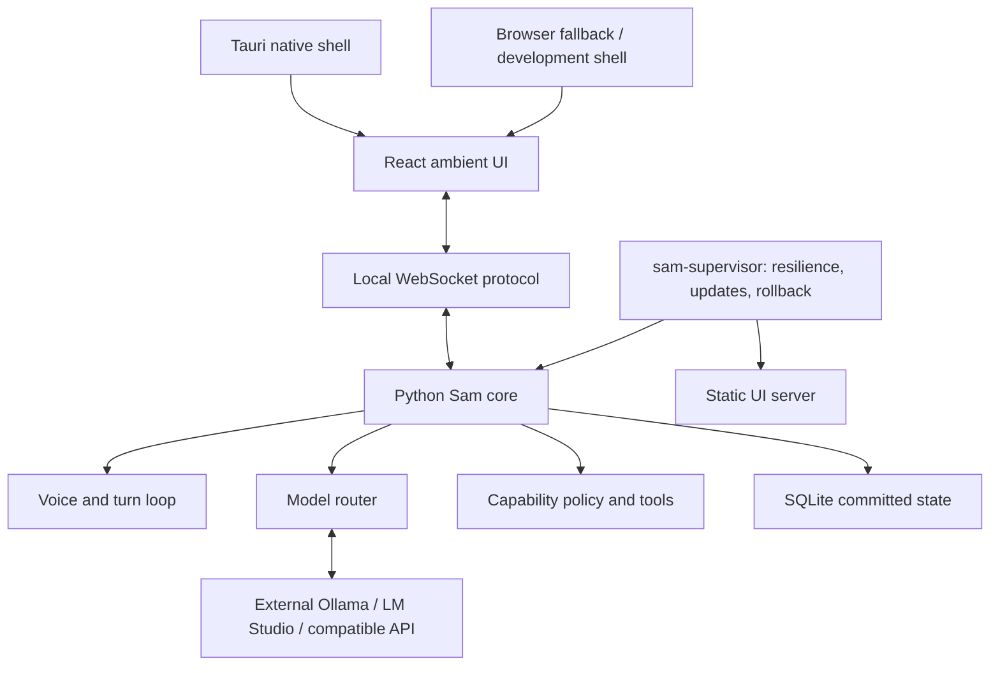

<p align="center">
  
</p>

# Sam

**A local-first ambient AI interface exploring what happens when artificial intelligence becomes a native layer of the computer itself.**

Sam combines a reactive ambient presence with interruptible conversation and
approval-controlled computer capabilities. Models and speech engines remain
replaceable; trusted code owns permissions, recovery, and updates.

Inspired in part by the vision of ambient computing portrayed in *Her*, Sam
explores an interaction model in which an AI assistant is not merely a chatbot
inside another application, but a persistent, conversational layer through
which the user can interact with the computer itself.

The ambition goes considerably further. Sam is being designed as an
**AI-native layer over the operating system**: able to work with local and
remote models, delegate to specialized agents, operate desktop applications,
adapt its own environment, and eventually propose, test, and safely deploy
modifications to its own software and even its Linux environment while
remaining under explicit user control. The goal is an assistant that can
progressively maintain and extend the computer it inhabits rather than merely
answer questions about it.

In the longer term, that points toward a more radical possibility:
**the AI itself becoming the primary user interface to the operating system**.

Instead of navigating fixed menus, settings panels, launchers, file managers,
and application-specific interfaces, the user could express intent directly
through voice, text, or context and let the AI compose the underlying system
actions dynamically while also generating the interaction surface itself at
runtime.

This includes **generative UI**: context-specific interfaces, visualizations,
controls, documents, dashboards, transient tools, or miniature task-specific
applications rendered on demand. Sam could choose the most useful
representation for each interaction and continuously recompose it as the
conversation, system state, and user intent evolve.

A response might appear as natural language in one moment, a live control panel
in the next, then an interactive graph, structured workspace, or hybrid of
several forms. In this model, **the interface itself becomes another generative
layer of the system rather than a static container built around predefined
workflows**.

Traditional graphical interfaces can remain available where useful, but
increasingly as one possible surface among many rather than the primary way the
user must understand and control the machine. The operating system itself
becomes less a collection of applications and windows that the user has to
learn to operate, and more a **programmable environment continuously
interpreted, orchestrated, and reshaped by an intelligent agent**.

Sam is an experiment toward that kind of computer: one in which interaction is
centered on **goals, conversation, context, and dynamically generated
interfaces**, rather than on manually traversing fixed software structures.

**Status:** 0.1.0 MVP complete; **0.1.2 alpha** improves conversational continuity,
local voice/provider startup, diagnostics, and graceful exit. Primary deployment target: Linux.
Windows development and system speech output are supported. The unreleased
Tauri 2 shell is compiled and lifecycle-validated on Windows; the packaged
browser UI remains the supported fallback until the Python companion is bundled.
On `dev`, speech follows detected response language using installed Windows voices
with locale/language fallback; see the [User Guide](docs/USER_GUIDE.md). No cloud
speech service or additional voice installation is performed automatically.

## What works today

- Ambient React UI driven by conversation state and normalized audio metrics.
- Full-duplex-oriented voice contracts, tentative barge-in, cancellation, and
  a ledger distinguishing generated text from spoken text.
- Local model selection: Ollama, LM Studio/llmster, and explicit
  OpenAI-compatible endpoints. No automatic model downloads or cloud fallback.
- Bounded filesystem and process tools, explicit approvals, and global
  capability revocation enforced outside the model.
- A separate supervisor with crash recovery, safe mode, durable committed
  text, and staged component updates with health checks and automatic rollback.



## Quick start

Requirements: Python 3.12+ and [uv](https://docs.astral.sh/uv/). For responses,
install a local inference runtime and at least one conversational model first.
Sam can start an installed Ollama or LM Studio/lms server and load an existing
LM Studio model; it never downloads models. Node, Vite, Rust, and Tauri are not
needed to run the compiled UI included in this repository.

From the checkout:

```sh
uv sync --locked
uv run sam-ambient
```

Sam starts the supervisor, core, and static UI, then opens
**[http://127.0.0.1:8766](http://127.0.0.1:8766)** once the application is ready.
The core bridge uses localhost port 8765. The browser can be closed and reopened
independently.

Native-shell development lives in `ui/src-tauri`. [Tauri 2](https://tauri.app/)
supplies only Sam's native window, application lifecycle, identity, and future
packaging boundary; React remains the UI and Python remains the supervisor/core.
Rust, Cargo, MSVC, and the Windows SDK are build dependencies, not intended user
requirements. Windows uses the installed WebView2 runtime. See
[Getting started](docs/GETTING_STARTED.md); this is not yet the redistributable
Sam installer because the self-contained Python companion is still separate.

Use **Controls → Text request** to talk to the selected model.

See [Getting started](docs/GETTING_STARTED.md) for prerequisites and first launch,
and the [User guide](docs/USER_GUIDE.md) for controls, status, and safe operation.

Sam loads versioned TOML configuration in this order: built-in defaults,
per-user configuration, `config/sam.toml` in the workspace, environment
overrides, then explicit CLI options. Copy
[`config/sam.example.toml`](config/sam.example.toml) to begin; runtime-learned
last-good model state and credentials remain separate from this file.

**Quit Sam** (or Ctrl+Q, with confirmation) stops the application; Ctrl+C works
in the launch console. Escape still closes the controls/fullscreen view.

```sh
uv run sam doctor --root .
uv run sam-ambient --verbose
uv run sam-ambient --provider lm-studio --model your-loaded-model
uv run sam-ambient --provider openai-compatible --base-url http://127.0.0.1:8000/v1
```

Selection is deterministic: explicit configuration first, then the last successful
local provider/model, then Ollama, LM Studio, and `--local-compatible-url`.
Stale saved preferences fall back; explicit unavailable choices stay degraded.
Startup waits at most 20 seconds per installed backend attempt. Running services
are reused without restart or model eviction. Sam-owned Ollama children stop on
exit; the shared LM Studio service remains running (Sam loads use a 10-minute
idle TTL). Expand the provider status for the selection reason and STT/TTS status.
`sam doctor` remains read-only and groups findings as READY, AVAILABLE, OPTIONAL,
MISSING, DEGRADED, or ACTION NEEDED. Restart Sam after externally changing services.

Voice input needs an audio device and a separately installed whisper.cpp
server, defaulting to `http://127.0.0.1:8080`. Windows output uses System.Speech;
Linux output uses a separately installed `espeak-ng` or `espeak` executable.

Missing voice dependencies leave text input/output available. Without a model,
the UI and diagnostics work, but Sam cannot generate a response.

Use `--no-voice --no-tts` for text-only operation.

The current working directory is the authorized read root; use `--root PATH`
to choose another. Writes require `--allow-workspace-write` and approval.
Process execution always requires approval and **is not an OS sandbox**.

Operational data stays in `<root>/.sam/`. See [Security](SECURITY.md).

## Build and install a package

Frontend development requires Node 22.12+ and pnpm (the version is pinned in
`ui/package.json`). Run `pnpm install --frozen-lockfile` inside `ui/`, then:

```sh
# Linux/macOS; use scripts/package.ps1 on Windows
scripts/package.sh
uv tool install ./dist/sam_ambient-0.1.2-py3-none-any.whl
sam-ambient --root /path/to/workspace
```

The wheel includes compiled UI assets, launchers, example configuration, and
notices. No models or third-party speech runtimes are bundled.

The release gate is also available locally through `scripts/test.*`,
`scripts/package.*`, and `scripts/check_release.py`. GitHub CI runs the equivalent
deterministic Python/frontend gates on Windows and Linux; releases remain manual.

## Limits and direction

Physical echo cancellation and Linux end-to-end voice tuning remain pending;
STT is final-only. Native installer packaging and supervisor self-update are
deferred. Windows guarantees direct-child termination, not full descendant
containment. Local staged updates require trusted preparation and validation.

Next: Linux audio/AEC validation, better Linux voices, and a seamless installer
that reuses the supported configuration/readiness layer. MCP capability providers and delegated workers are
future external adapters, not features of this release.

Longer term, Sam's architecture is intended to support increasingly capable
computer-use backends, delegated agents, dynamically generated interaction
surfaces, and deeper integration with the host operating environment without
making any single model provider, desktop-control system, or UI framework
fundamental to the design.

[Architecture](docs/ARCHITECTURE.md) ·
[Troubleshooting](docs/TROUBLESHOOTING.md) ·
[Changelog](CHANGELOG.md) ·
[Contributing](CONTRIBUTING.md)

## License

Sam is licensed under [Apache-2.0](LICENSE) and may be used, modified, and
distributed subject to that license. See [NOTICE](NOTICE) for attribution.

Third-party software retains its own terms, recorded in
[THIRD_PARTY.md](THIRD_PARTY.md).

---

*Sam is an independent project inspired by broader ideas of ambient and
AI-native computing, including concepts portrayed in* Her. *It is not affiliated
with or endorsed by the film or its rights holders.*
