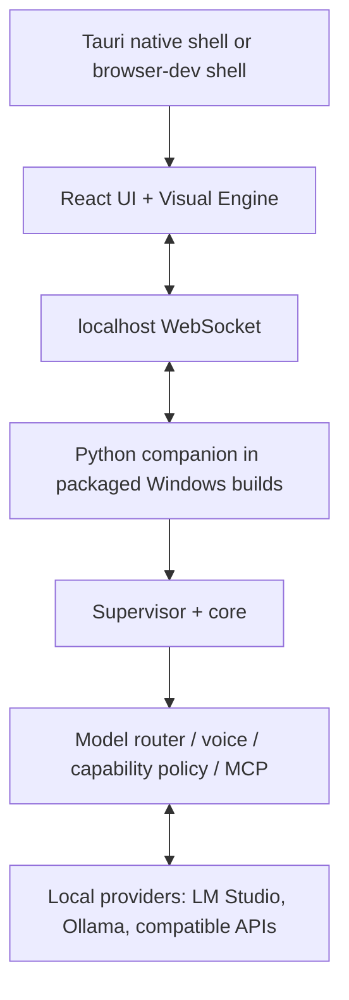

<p align="center">
  
</p>

# Sam

**A local-first ambient AI interface exploring what happens when artificial intelligence becomes a native layer of the computer itself.**

Sam combines a reactive ambient presence with interruptible conversation and
approval-controlled computer capabilities. Models and speech engines remain
replaceable; trusted code owns permissions, recovery, and updates.

Inspired in part by the vision of ambient computing portrayed in *Her*, Sam
explores an interaction model in which an AI assistant is not merely a chatbot
inside another application, but a persistent, conversational layer through
which the user can interact with the computer itself.

The ambition goes considerably further. Sam is being designed as an
**AI-native layer over the operating system**: able to work with local and
remote models, delegate to specialized agents, operate desktop applications,
adapt its own environment, and eventually propose, test, and safely deploy
modifications to its own software and even its Linux environment while
remaining under explicit user control. The goal is an assistant that can
progressively maintain and extend the computer it inhabits rather than merely
answer questions about it.

In the longer term, that points toward a more radical possibility:
**the AI itself becoming the primary user interface to the operating system**.

Instead of navigating fixed menus, settings panels, launchers, file managers,
and application-specific interfaces, the user could express intent directly
through voice, text, or context and let the AI compose the underlying system
actions dynamically while also generating the interaction surface itself at
runtime.

This includes **generative UI**: context-specific interfaces, visualizations,
controls, documents, dashboards, transient tools, or miniature task-specific
applications rendered on demand. Sam could choose the most useful
representation for each interaction and continuously recompose it as the
conversation, system state, and user intent evolve.

A response might appear as natural language in one moment, a live control panel
in the next, then an interactive graph, structured workspace, or hybrid of
several forms. In this model, **the interface itself becomes another generative
layer of the system rather than a static container built around predefined
workflows**.

Traditional graphical interfaces can remain available where useful, but
increasingly as one possible surface among many rather than the primary way the
user must understand and control the machine. The operating system itself
becomes less a collection of applications and windows that the user has to
learn to operate, and more a **programmable environment continuously
interpreted, orchestrated, and reshaped by an intelligent agent**.

Sam is an experiment toward that kind of computer: one in which interaction is
centered on **goals, conversation, context, and dynamically generated
interfaces**, rather than on manually traversing fixed software structures.

**Status:** **Sam 0.2.1 alpha release candidate.** Windows is the currently
validated local-provider and native-package path. Full Linux compatibility is
deferred to the dedicated 0.3.0 Linux review; the remaining hosted Ubuntu Python-test
failure is a known non-blocker under the current Windows-first alpha policy.
Packaging, signing, antivirus review, and final human voice/visual/native acceptance
remain human release gates. Text interaction is the recommended, most reliable
0.2.1 alpha mode; voice input remains experimental.
The development line opens an isolated Sam app window with installed Edge/Chrome/
Chromium. Use `uv run sam-ambient --ui-mode browser` for normal-browser/debug mode;
if no supported app browser is found, the default browser remains the fallback.
Starting the same Sam root twice reports the existing local UI instead of creating
competing runtimes. Closing the dedicated window gracefully stops Sam.
The integrated, unreleased Tauri 2 shell provides the same ambient UI in a native
window and starts a self-contained Python companion through a fixed resource
boundary. It remains development-only until native packaging, signing, antivirus,
and human acceptance gates are completed.
On `dev`, speech follows detected response language using installed Windows voices
with locale/language fallback; see the [User Guide](docs/USER_GUIDE.md). No cloud
speech service or additional voice installation is performed automatically.

## What works today

- Ambient React UI driven by conversation state and normalized audio metrics.
- Full-duplex-oriented voice contracts, tentative barge-in, cancellation, and
  a ledger distinguishing generated text from spoken text.
- Local model selection: Ollama, LM Studio/llmster, and explicit
  OpenAI-compatible endpoints. No automatic model downloads or cloud fallback.
- Bounded filesystem and process tools, explicit approvals, and global
  capability revocation enforced outside the model.
- Approval-gated local MCP stdio adapter seam; no external server or desktop
  control backend is bundled.
- A separate supervisor with crash recovery, safe mode, durable committed
  text, and staged component updates with health checks and automatic rollback.



## Quick start

### Supported Windows source path

Runtime requirements are Python 3.12+, [uv](https://docs.astral.sh/uv/), and a
local conversational model provider. [LM Studio](https://lmstudio.ai/) is the
currently recommended and validated provider. Install it, open it once so its
bundled `lms` command is available, then use LM Studio's model search/download
view to download a chat/instruct model that fits your machine. `lms ls` lists
models installed on disk; `lms ps` lists models currently loaded in memory. Sam
may load an existing explicit, last-good, or sole installed conversational model,
but never downloads a model. With several viable models, choose one in the startup picker.

Node/pnpm is needed only to rebuild the React UI. Rust, Cargo, Tauri, MSVC Build
Tools, and the Windows SDK are native-shell developer prerequisites; they are not
end-user requirements for a future packaged Sam installation.

From the checkout:

```sh
uv sync --locked
uv run sam-ambient
```

This is the normal source launch command. On first launch Sam starts the supervisor,
core, and static UI, then opens
**[http://127.0.0.1:8766](http://127.0.0.1:8766)** once the UI is ready. The window
shows core/model/speech preparation rather than remaining blank. The core bridge
uses localhost port 8765. Closing the dedicated window stops Sam; a normal browser
fallback can be closed and reopened independently.

Native-shell source lives in `ui/src-tauri`. Tauri supplies only the native
window, application lifecycle, identity, and packaged-resource boundary; React
remains the UI and Python remains the supervisor/core. Rust, Cargo, MSVC, and the
Windows SDK are build dependencies, not intended end-user requirements. The
guarded NSIS path bundles the Python companion, while providers, models, and
Whisper assets remain external. Browser mode remains supported. See
[Getting started](docs/GETTING_STARTED.md) for native development details.

Use **Controls → Text request** to type, or enable **Microphone** when the separate
speech prerequisites are ready. **Rescan providers/models** refreshes inventory;
**Restart Sam** restarts managed Python components while keeping external model
services available; **Reload interface** reconnects only the React UI; and
**Quit Sam** performs confirmed shutdown. Input/output gain, visual quality,
performance profile, reduced motion, intensity, and local-resource-on-exit
preferences are in Controls. Exit preferences default to keeping providers and
models available and only act on resources Sam itself started or loaded.

The Visual Engine uses a warm, responsive light field rather than a solid sphere.
Listening opens the ribbons, transcription gathers them, thinking folds inward,
and speaking follows output amplitude. Controls remain keyboard-accessible at the
lower edge; reduced-motion preference keeps state feedback without continuous motion.
Expand the model line in Controls for provider selection, speech readiness, chosen
voice, actionable limitations, and local/cloud policy.

See [Getting started](docs/GETTING_STARTED.md) for prerequisites and first launch,
and the [User guide](docs/USER_GUIDE.md) for controls, status, and safe operation.

Sam loads versioned TOML configuration in this order: built-in defaults,
per-user configuration, `config/sam.toml` in the workspace, environment
overrides, then explicit CLI options. Copy
[`config/sam.example.toml`](config/sam.example.toml) to begin; runtime-learned
last-good model state and credentials remain separate from this file.

**Quit Sam** (or Ctrl+Q, with confirmation) stops the application; Ctrl+C works
in the launch console. Escape still closes the controls/fullscreen view.

```sh
uv run sam doctor --root .
uv run sam-ambient --verbose
uv run sam-ambient --provider lm-studio --model your-loaded-model
uv run sam-ambient --provider openai-compatible --base-url http://127.0.0.1:8000/v1
```

Selection is deterministic: a valid explicit local provider/model first, then a valid
last-successful local choice, then the sole installed conversational model. Multiple
viable models require owner selection rather than an arbitrary list-order choice.
Stale saved preferences fall back; explicit unavailable choices stay degraded.
Provider startup/readiness stays short; an explicit, remembered, or sole installed
LM Studio chat model gets a separate cancellable 180-second load window. Multiple
installed candidates require an explicit choice. Running services and loaded models
are reused without transferring ownership. Graceful-Quit cleanup defaults to keeping
resources; owner opt-in can unload only a model Sam loaded or stop only a service Sam
started. Restart and Emergency Stop do not apply those exit policies. Expand the
provider status for the selection reason and STT/TTS status.
`sam doctor` remains read-only and groups findings as READY, AVAILABLE, OPTIONAL,
MISSING, DEGRADED, or ACTION NEEDED. **Rescan providers/models** can detect bounded
local availability changes without requiring a restart when safe.

Voice input needs an audio device and a separately installed whisper.cpp
server, defaulting to `http://127.0.0.1:8080`. Windows output uses System.Speech;
Linux output uses a separately installed `espeak-ng` or `espeak` executable.

Missing voice dependencies leave text input/output available. Without a model,
the UI and diagnostics work, but Sam cannot generate a response.

Use `--no-voice --no-tts` for text-only operation.

The current working directory is the authorized read root; use `--root PATH`
to choose another. Writes require `--allow-workspace-write` and approval.
Process execution always requires approval and **is not an OS sandbox**.

Operational data stays in `<root>/.sam/`. See [Security](SECURITY.md).

## Build and install a package

Frontend development requires Node 22.12+ and pnpm (the version is pinned in
`ui/package.json`). Run `pnpm install --frozen-lockfile` inside `ui/`, then:

```sh
# Linux/macOS; use scripts/package.ps1 on Windows
scripts/package.sh
uv tool install ./dist/sam_ambient-0.2.1-py3-none-any.whl
sam-ambient --root /path/to/workspace
```

The wheel includes compiled UI assets, launchers, example configuration, and
notices. No models or third-party speech runtimes are bundled.

The release gate is also available locally through `scripts/test.*`,
`scripts/package.*`, and `scripts/check_release.py`. GitHub CI runs the equivalent
deterministic Python/frontend gates on Windows and Linux; releases remain manual.

## Limits and direction

Physical echo cancellation and Linux end-to-end voice tuning remain pending;
STT is final-only. Native package/release validation, signing/AV review, and
supervisor self-update are deferred. Windows guarantees direct-child termination,
not full descendant containment. Local staged updates require trusted preparation
and validation.

Next: combined native/ambient human acceptance, physical voice acceptance, and a
seamless installer using the supported readiness layer. The integrated native
source is not release approval. The local MCP stdio seam exists on `dev`;
deskwright, remote MCP transports, and delegated workers are
future integrations, not features of this release. See the [Roadmap](docs/ROADMAP.md).

Longer term, Sam's architecture is intended to support increasingly capable
computer-use backends, delegated agents, dynamically generated interaction
surfaces, and deeper integration with the host operating environment without
making any single model provider, desktop-control system, or UI framework
fundamental to the design.

[Architecture](docs/ARCHITECTURE.md) ·
[Troubleshooting](docs/TROUBLESHOOTING.md) ·
[Changelog](CHANGELOG.md) ·
[Contributing](CONTRIBUTING.md)

## License

Sam is licensed under [Apache-2.0](LICENSE) and may be used, modified, and
distributed subject to that license. See [NOTICE](NOTICE) for attribution.

Third-party software retains its own terms, recorded in
[THIRD_PARTY.md](THIRD_PARTY.md).

---

*Sam is an independent project inspired by broader ideas of ambient and
AI-native computing, including concepts portrayed in* Her. *It is not affiliated
with or endorsed by the film or its rights holders.*
