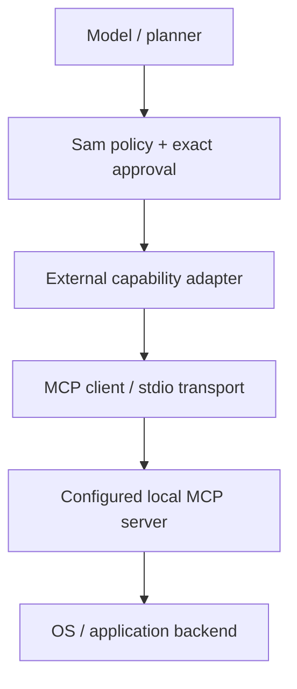

# Architecture

Sam is a supervised modular monolith with a separate ambient presentation client.
The installed `sam-ambient` command starts `sam-supervisor`, the authoritative
`sam-core`, and an optional static `sam-ui` server. The supervisor opens the UI
after its HTTP readiness, while core startup continues visibly in the window.
Presentation failure never becomes a core crash/restart condition.

## Trusted lifecycle

The supervisor contains no LLM/provider logic. Trusted argv specifications launch
components, whose instance-correlated readiness records distinguish initialization
from health. Crashes trigger bounded backoff; three failures within 60 seconds
enter crash-loop handling/safe mode. Capability authority is revoked before
critical restart. Child stdin carries only a graceful stop request; the core can
relay a direct UI quit over its instance-bound stdout lifecycle channel. Quit is
not a tool and cannot launch a process or restore authority.
On Windows the version launcher runs the resolved entry point in its existing
child process; POSIX uses `exec`. This keeps lifecycle pipes and process identity
attached to the component the supervisor actually monitors.

## Core and UI

The supervisor's small `AppWindow` adapter launches installed Chromium-family
application mode with structured argv and a separate `.sam/ui-profile`, not the
owner's browsing profile. Windows shutdown posts WM_CLOSE only to the launched
process's windows; there is no browser process killing. Linux currently retains
the stopped window for manual closure. App-window exit requests orderly shutdown
but is never interpreted as a component crash or restart condition.
`--ui-mode browser` bypasses this adapter; missing app browsers fall back to the
default browser. The existing native transport seam remains available for Tauri.
An OS-released per-root lock prevents competing supervisors. The dedicated app
process exiting requests the same idempotent graceful shutdown as Ctrl+C; normal
browser tabs remain independent because their lifetime is not a reliable signal.

`SamRuntime` owns conversation state, the event bus, cancellation registry, voice
adapters, provider router, tool executor, and session persistence. React/TypeScript
consumes versioned events over the localhost WebSocket bridge. Its reducer rejects
stale events and coalesces high-frequency visualization updates. Text, approvals,
provider/model selection, and connection status stay secondary to the ambient
field. Visual preferences remain local to the UI.

[Sam Visual Engine v1](VISUAL_ENGINE_V1.md) specifies the future shell-neutral
renderer, audio/state contract and visual settings. It is a design specification,
not a description of a completed renderer. This branch's acceptance-pending Canvas
field remains a bounded shell-neutral checkpoint fed by the current reducer; it
does not define the future geometry. Its Vite-only preview exercises the real event
decoder and reducer and is not packaged.

## Configuration and readiness

`SamSettings` is the validated, versioned user-intent boundary. Standard-library
TOML loading merges safe defaults, per-user and workspace files, bounded `SAM_*`
environment overrides, then options explicitly present on the CLI. The same
resolved values feed supervisor launch specifications and direct runtime/doctor
commands. Unknown fields fail closed. Credentials are adapter environment/service
configuration, and learned last-good provider/model data remains operational
SQLite state; neither is written into user TOML.

Doctor probes existing adapters and produces bounded facts. A pure readiness
classifier maps them to stable user/action categories, providing the shared seam
for a future installer without giving installer logic separate dependency rules.
It does not install applications or download models.

## Voice and providers

Bounded PCM frames connect sounddevice, WebRTC VAD, the loopback whisper.cpp
final-STT adapter, the turn state machine, and system TTS. Interruption first
becomes a candidate; duration/transcript heuristics decide whether to cancel or
recover. Shared cancellation IDs reach model/TTS/tools. A delivery ledger records
generated, queued, and spoken chunks. Real hardware AEC remains future work.

TTS keeps the existing `synthesize(text, voice, language, cancellation)` PCM-frame
iterator. Each frame carries format/sample-rate metadata; synthesis may buffer
internally (System.Speech) or stream, while playback remains a separate adapter.
Optional immutable `SpeechCapabilities`, `SpeechVoice`, `VoiceSelection` and
`list_voices()` expose provider identity/selection without vendor concepts in core.
Response-language detection runs locally off the event loop; short/ambiguous text
uses confirmed STT or recent response/configured language. Installed Windows voices
resolve exact locale, same language, then configured/system fallback. eSpeak
receives a language selector and resolves installed voices externally.
Network speech is currently refused by the runtime even when cloud LLM routing is
enabled. A future network speech adapter requires separate explicit trusted
opt-in and external credential configuration. Rich prosody/style can later extend
adapter options when a real backend needs it; no vendor SDK or unused emotion
schema is present. New adapters must retain cancellation and PCM-format contracts.

At startup, bounded discovery checks explicit local configuration, Ollama's
configured/default endpoint, LM Studio's conventional or CLI-reported local port,
and an additional explicitly configured compatible endpoint. Selection uses that
priority and sorted model IDs, preferring the last successful local provider/model
stored in existing SQLite runtime metadata. Explicit choices are never silently replaced.
LM Studio uses its published [status CLI](https://lmstudio.ai/docs/cli/serve/server-status)
and [model APIs](https://lmstudio.ai/docs/developer/rest/endpoints); loaded models
are preferred when native metadata exists. Compatible-only servers supply their
advertised model IDs, excluding declared/named embeddings; Ollama models must
declare completion capability. Diagnostics stay read-only. Application startup
can run structured `ollama serve` / `lms server start` and load an installed LM
model, with a 20-second per-backend deadline and no downloads. Existing services
are never stopped or restarted. Only direct Sam-owned Ollama children are reaped;
the shared LM daemon/server is retained and Sam-loaded models have a 600-second
idle TTL. No authority or settings are granted by model-generated content.
Ollama and OpenAI-compatible adapters retain the existing provider interface.
Endpoint protocol support, not a conventional port, determines compatibility;
discovery names describe probe routes rather than authenticated vendor identity.
Transparent local inference routers such as NVIDIA PAIR are a future compatible
backend direction through these endpoints, not an implemented PAIR integration.

## Capability policy

An explicit immutable registry declares schema, risk, platform, timeout, and
side effects. Runtime code validates scope and invocation-specific approvals.
Authorized paths reject traversal and resolved symlink/junction escapes.
Bounded process argv uses `shell=False`; execution still has owner OS permissions.
Global revoke advances the authority epoch, invalidates approvals/leases, and
cancels compatible work. Tool schemas and invocation arguments are recursively
immutable after trusted construction. The model cannot authorize itself or restore
authority.

## Persistence and updates

SQLite stores committed text, security epoch, component state, a bounded crash
journal, and update transactions. Raw audio and in-flight work are not restored.
Versioned artifacts remain separate from live code; trusted validation precedes
atomic `active.json` replacement. The stable launcher resolves and re-hashes the
active core's fixed entry point on each restart. Candidates become last-known-good
only after health observation. Failure restores the previous version; double
failure enters safe mode. Candidate content is re-hashed after observation and the
rollback target must retain its persisted trusted hash. Supervisor self-update
requires a later trusted bootstrap.

## External adapters

Models, STT, TTS, and platform capabilities are replaceable adapters. Sam now has
a bounded MCP stdio client for trusted configured local capability servers. It
implements current per-request metadata/server discovery, paginated tools/list,
tools/call, cancellation, and stdio
shutdown without a new SDK dependency. Streamable HTTP is a future transport;
legacy SSE is intentionally excluded.

Discovery creates recursively immutable, collision-safe Sam descriptors. All
external tools are approval-required external side effects. Sam checks a catalog
fingerprint again before execution; results remain untrusted bounded data. Existing
lease epochs, Emergency Stop, cancellation, stale-generation, and audit rules stay
authoritative. Models and workspace config cannot supply server launch details.

Deskwright remains a future Linux GNOME/Wayland server launched as a trusted local
command below this boundary. Semantic actions and headless/private desktop sessions
are backend behavior, never a policy bypass. Delegated workers are also future;
none owns supervisor/update authority.

## Release assurance

Local scripts remain authoritative for development. GitHub Actions repeats the
deterministic Python and frontend quality gates on Windows/Linux, then builds the
wheel/source distribution and installs the wheel for a CLI/metadata smoke check.
Live provider/audio checks and publishing are deliberately human-controlled.
