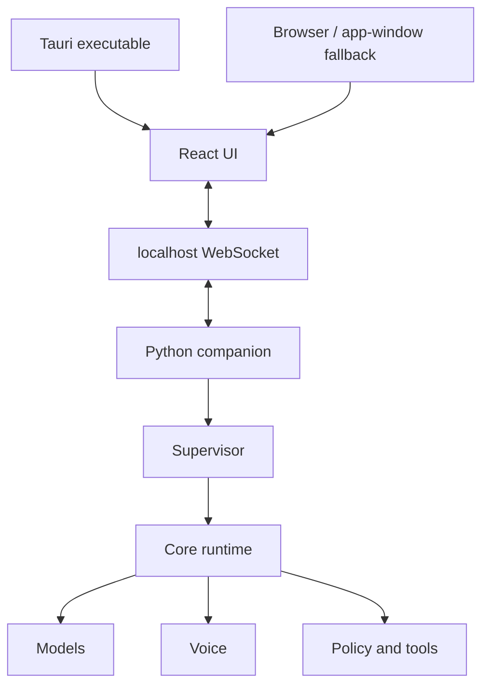
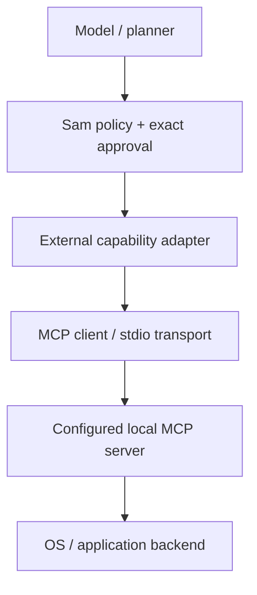

# Architecture

Sam is a supervised modular monolith with a separate ambient presentation client.
The installed `sam-ambient` command starts `sam-supervisor`, the authoritative
`sam-core`, and an optional static `sam-ui` server. The supervisor opens the UI
after its HTTP readiness, while core startup continues visibly in the window.
Presentation failure never becomes a core crash/restart condition.

## Trusted lifecycle

The supervisor contains no LLM/provider logic. Trusted argv specifications launch
components, whose instance-correlated readiness records distinguish initialization
from health. Crashes trigger bounded backoff; three failures within 60 seconds
enter crash-loop handling/safe mode. Capability authority is revoked before
critical restart. Child stdin carries only a graceful stop request; the core can
relay a direct UI quit over its instance-bound stdout lifecycle channel. Quit is
not a tool and cannot launch a process or restore authority.
On Windows the version launcher runs the resolved entry point in its existing
child process; POSIX uses `exec`. This keeps lifecycle pipes and process identity
attached to the component the supervisor actually monitors.

## Core and UI

The supervisor's small `AppWindow` adapter launches installed Chromium-family
application mode with structured argv and a separate `.sam/ui-profile`, not the
owner's browsing profile. Windows shutdown posts WM_CLOSE only to the launched
process's windows; there is no browser process killing. Linux currently retains
the stopped window for manual closure. App-window exit requests orderly shutdown
but is never interpreted as a component crash or restart condition.
`--ui-mode browser` bypasses this adapter; missing app browsers fall back to the
default browser. The existing native transport seam remains available for Tauri.
An OS-released per-root lock prevents competing supervisors. The dedicated app
process exiting requests the same idempotent graceful shutdown as Ctrl+C; normal
browser tabs remain independent because their lifetime is not a reliable signal.

`SamRuntime` owns conversation state, the event bus, cancellation registry, voice
adapters, provider router, tool executor, and session persistence. React/TypeScript
consumes versioned events over the localhost WebSocket bridge. Its reducer rejects
stale events and coalesces high-frequency visualization updates. Text, approvals,
provider/model selection, and connection status stay secondary to the ambient
field. Visual preferences use the typed runtime-settings boundary and persisted
preference store; adaptive resolved quality remains renderer-local and is not
persisted as user intent.

Provider discovery is an explicit frontend operation beside the transport state.
Rescan/model-select commands have unique ids; core discovery events echo the id,
and the client retains the latest id across completion to reject late older scans.
The transport epoch separately rejects events from earlier WebSocket connections.
Core discovery serializes replacement scans and publishes scanning, ready,
blocked or failed results. A definitive empty result clears active model
availability; persisted last-good model preference remains separate. Disconnected
catalog and selection data are last-known only, and a new `system.ready` is the
authoritative reconnect snapshot. Command acknowledgements have a bounded wait,
while a terminal discovery event can itself release the command's pending UI state.

`TurnManager` is the core authority for voice lifecycle transitions. A text turn
is committed by the runtime (through `accept_text_turn` when voice is active);
an uncommitted voice turn enters through
capture, VAD and STT, then both use the same model generation, delivery ledger,
cancellation token and speech path. Voice STT `transcript.final` is evidence,
not commitment: only `turn.committed` adds the user utterance to the committed
UI transcript. Typed `transcript.final` carries `source=text` and may commit at
acceptance. The frontend reducer is a single correlated projection of core
state, not a second independent conversation controller. It keeps a tentative
candidate ID separate from the active turn, retires superseded/terminal IDs,
and rejects late turn/generation events. An input pipeline that stops before
commit publishes `stt.cancelled` and IDLE; this is idempotent and does not
cancel an already committed model response. Capture health is reported apart
from generation failure, so speech input loss cannot make a healthy output
turn disappear. Model completion and speech delivery have separate terminal
outcomes: a later synthesis/playback exception emits `tts.failed`, preserving
the committed text and the model's completed result.

Connection epochs reject callbacks from old sockets. A fresh `system.ready`
snapshot carries the core's current turn/generation IDs when a turn is active;
the frontend reattaches only that identity. Core text commands echo their
originating command ID on acceptance or pre-acceptance terminal events. A
correlated lifecycle event can release the pending UI command before its ACK;
late ACK/rejection cannot reopen it. Rescan changes availability for future
turns but never silently replaces the model already chosen for an active
generation. The UI disables new text submission when no model is active.

Capture endpoint waits are owned by `TurnManager`/`VoiceInputPipeline`, including
the bounded candidate-duration path. Provider adapters own model stream and
first-useful-content deadlines; the frontend owns a 30-second command ACK
bound. There is no new universal STT/TTS/playback deadline in this pass.
Deterministic tests prove state and correlation behavior; physical devices,
actual provider timing, and real speech latency remain integration gates.

[Sam Visual Engine v1](VISUAL_ENGINE_V1.md) remains the authoritative shell-neutral
renderer, audio/state and visual-settings specification. `dev` implements its
Stages A-D: a typed envelope-only adapter and isolated WebGL2 spheroid with bounded
continuous state/audio motion, batched lifted membrane fragments, analytic lights
and sparse environmental particles, with Canvas/CSS fallback. It also implements direct pointer/touch rotation,
damped inertia, persisted typed visual settings, profile-capped mobile emulation and
measured quality adaptation. Spectral extraction, prosodic mapping and human visual
acceptance remain pending. The WebGL body and membrane share a deterministic
object-space field. Engine-owned elapsed-time clocks separately advance orientation,
relief, material shears, palette evolution, lighting and particles; pointer ownership
temporarily reduces the material rate without resetting phase. The existing quality
tiers retain the same broad field, with optional fine samples only on higher tiers.
A visual-only AmbientReactivity layer smooths existing reported envelopes into
bounded perturbations of those autonomous systems; it carries no microphone,
speech or conversational authority. [Sam Orb visual direction](VISUAL_DIRECTION.md)
records remaining artistic work. The compiled static bundle uses the real event decoder
and reducer.

## Native shell boundary

The thin Tauri 2 executable owns only a native window, single-instance focus,
native identity, one trusted supervisor child, and close coordination. React still
owns presentation and speaks protocol-v1 over the localhost WebSocket. The Python
companion still owns supervision, core/runtime behavior, models, voice, policy,
tools, persistence, and updates. Tauri exposes no general filesystem, shell, or
process capability to the frontend.

```mermaid
flowchart TD
    Tauri[Tauri executable] --> React[React UI]
    Browser[Browser / app-window fallback] --> React
    React <--> WS[localhost WebSocket]
    WS <--> Companion[Python companion]
    Companion --> Supervisor[Supervisor]
    Supervisor --> Core[Core runtime]
    Core --> Models[Models]
    Core --> Voice[Voice]
    Core --> Policy[Policy and tools]
```

Development mode starts the trusted checkout command with `--no-ui`; release-mode
source resolves only `companion/sam-supervisor[.exe]` under Tauri's resource
directory and passes a writable per-user application-data root. A frozen supervisor
may launch only fixed sibling `sam-core` and `sam-ui` executables. Normal native
close emits a fixed event into React, which opens Sam's existing Quit confirmation;
only acknowledged runtime shutdown enables the window to close. A bounded native
exit fallback terminates only the supervisor child it created.

The source tree includes the companion/resource layout and guarded Windows NSIS
assembly path, but packaging, signing, antivirus review, and installer acceptance
are separate release gates. Browser and Chromium app-window modes remain supported.

## Configuration and readiness

`SamSettings` is the validated, versioned user-intent boundary. Standard-library
TOML loading merges safe defaults, per-user and workspace files, bounded `SAM_*`
environment overrides, then options explicitly present on the CLI. The same
resolved values feed supervisor launch specifications and direct runtime/doctor
commands. Unknown fields fail closed. Credentials are adapter environment/service
configuration, and learned last-good provider/model data remains operational
SQLite state; neither is written into user TOML.

Doctor probes existing adapters and produces bounded facts. A pure readiness
classifier maps them to stable user/action categories, providing the shared seam
for a future installer without giving installer logic separate dependency rules.
It does not install applications or download models.

## Voice and providers

Bounded PCM frames connect sounddevice, WebRTC VAD, the loopback whisper.cpp
final-STT adapter, the turn state machine, and system TTS. Interruption first
becomes a candidate. During playback, VAD alone cannot commit it: final candidate
text must be credible and probable overlap with current assistant output is rejected
before it becomes a user turn. Shared cancellation IDs reach model/TTS/tools. A delivery ledger records
generated, queued, and spoken chunks. Real hardware AEC remains future work.

Each interruption candidate owns one STT stream. Finalization removes that stream
from the capture path before awaiting its result; final/rejected/cancelled streams
cannot receive further frames. Confirmations pass through the interruption controller
before event publication. Capture availability is reported as `component.health`
for `voice_input`, independently of model/TTS state. Input failure disposes only
tentative candidates; it cannot force a healthy response's playback OFFLINE.

TTS keeps the existing `synthesize(text, voice, language, cancellation)` PCM-frame
iterator. Each frame carries format/sample-rate metadata; synthesis may buffer
internally (System.Speech) or stream, while playback remains a separate adapter.
Optional immutable `SpeechCapabilities`, `SpeechVoice`, `VoiceSelection` and
`list_voices()` expose provider identity/selection without vendor concepts in core.
Response-language detection runs locally off the event loop; short/ambiguous text
uses confirmed STT or recent response/configured language. Installed Windows voices
resolve exact locale, same language, then configured/system fallback. eSpeak
receives a language selector and resolves installed voices externally.
Network speech is currently refused by the runtime even when cloud LLM routing is
enabled. A future network speech adapter requires separate explicit trusted
opt-in and external credential configuration. Rich prosody/style can later extend
adapter options when a real backend needs it; no vendor SDK or unused emotion
schema is present. New adapters must retain cancellation and PCM-format contracts.

At startup, bounded discovery checks explicit local configuration, Ollama's
configured/default endpoint, LM Studio's conventional or CLI-reported local port,
and an additional explicitly configured compatible endpoint. Selection requires,
in order, a valid explicit model, a valid last-successful local model stored in
SQLite, or exactly one installed local conversational model. Several candidates
remain blocked for owner choice; explicit choices are never silently replaced.
LM Studio uses its published [status CLI](https://lmstudio.ai/docs/cli/serve/server-status)
and model inventory/API boundaries: `lms ls` identifies installed models while
serving/native metadata identifies models actually loaded. Compatible-only servers supply their
advertised model IDs, excluding declared/named embeddings; Ollama models must
declare completion capability. Diagnostics stay read-only. Application startup
can run structured `ollama serve` / `lms server start` with short readiness bounds.
LM model loading is a separate cancellable 180-second phase; only an explicit,
remembered, or sole installed chat model is auto-loaded. Multiple candidates
require owner selection, and no downloads occur. The UI connects before this
potentially long load, receives truthful lifecycle events, and can request a
fresh bounded discovery through the trusted control boundary. Existing services
are never claimed merely because discovery finds them. Successful Sam start/load
actions establish independent service/model provenance; model selection alone
establishes neither. Direct Ollama process handles remain process-local. LM Studio
service/model provenance may cross a managed core Restart only under the supervisor's
random application-lifetime identity; the same SQLite record is inert for a later Sam launch.
Graceful Quit defaults to keeping both. An explicit owner preference may first unload
a Sam-loaded LM Studio model through bounded structured `lms` argv, then stop a
service only when Sam started it.
Ollama has no model-unload claim in this layer; compatible/remote providers report
unsupported. Restart, Emergency Stop, rescans, and future launches do not acquire or
apply exit-cleanup authority. Cleanup failures are logged and cannot block shutdown.
Because provider APIs do not expose a universal resource-incarnation token, Sam never
reconstructs service ownership from a PID. If the external world replaces a same-ID
LM Studio model within one supervisor lifetime, Sam can verify only its current ID,
not an unavailable incarnation token; this is a documented adapter limitation. No
authority or settings are granted by model-generated content.
Ollama and OpenAI-compatible adapters retain the existing provider interface.
Endpoint protocol support, not a conventional port, determines compatibility;
discovery names describe probe routes rather than authenticated vendor identity.
Transparent local inference routers such as NVIDIA PAIR are a future compatible
backend direction through these endpoints, not an implemented PAIR integration.

## Capability policy

An explicit immutable registry declares schema, risk, platform, timeout, and
side effects. Runtime code validates scope and invocation-specific approvals.
Authorized paths reject traversal and resolved symlink/junction escapes.
Bounded process argv uses `shell=False`; execution still has owner OS permissions.
Global revoke advances the authority epoch, invalidates approvals/leases, and
cancels compatible work. Tool schemas and invocation arguments are recursively
immutable after trusted construction. The model cannot authorize itself or restore
authority.

## Persistence and updates

SQLite stores committed text, security epoch, component state, a bounded crash
journal, and update transactions. Raw audio and in-flight work are not restored.
Versioned artifacts remain separate from live code; trusted validation precedes
atomic `active.json` replacement. The stable launcher resolves and re-hashes the
active core's fixed entry point on each restart. Candidates become last-known-good
only after health observation. Failure restores the previous version; double
failure enters safe mode. Candidate content is re-hashed after observation and the
rollback target must retain its persisted trusted hash. Supervisor self-update
requires a later trusted bootstrap.

## External adapters

Models, STT, TTS, and platform capabilities are replaceable adapters. Sam now has
a bounded MCP stdio client for trusted configured local capability servers. It
implements current per-request metadata/server discovery, paginated tools/list,
tools/call, cancellation, and stdio
shutdown without a new SDK dependency. Streamable HTTP is a future transport;
legacy SSE is intentionally excluded.

```mermaid
flowchart TD
    Model[Model / planner] --> Policy[Sam policy + exact approval]
    Policy --> Adapter[External capability adapter]
    Adapter --> MCP[MCP client / stdio transport]
    MCP --> Server[Configured local MCP server]
    Server --> Backend[OS / application backend]
```

Discovery creates recursively immutable, collision-safe Sam descriptors. All
external tools are approval-required external side effects. Sam checks a catalog
fingerprint again before execution; results remain untrusted bounded data. Existing
lease epochs, Emergency Stop, cancellation, stale-generation, and audit rules stay
authoritative. Models and workspace config cannot supply server launch details.

Deskwright remains a future Linux GNOME/Wayland server launched as a trusted local
command below this boundary. Semantic actions and headless/private desktop sessions
are backend behavior, never a policy bypass. Delegated workers are also future;
none owns supervisor/update authority.

## Release assurance

Local scripts remain authoritative for development. GitHub Actions repeats the
deterministic Python and frontend quality gates on Windows/Linux, then builds the
wheel/source distribution and installs the wheel for a CLI/metadata smoke check.
Live provider/audio checks and publishing are deliberately human-controlled.
